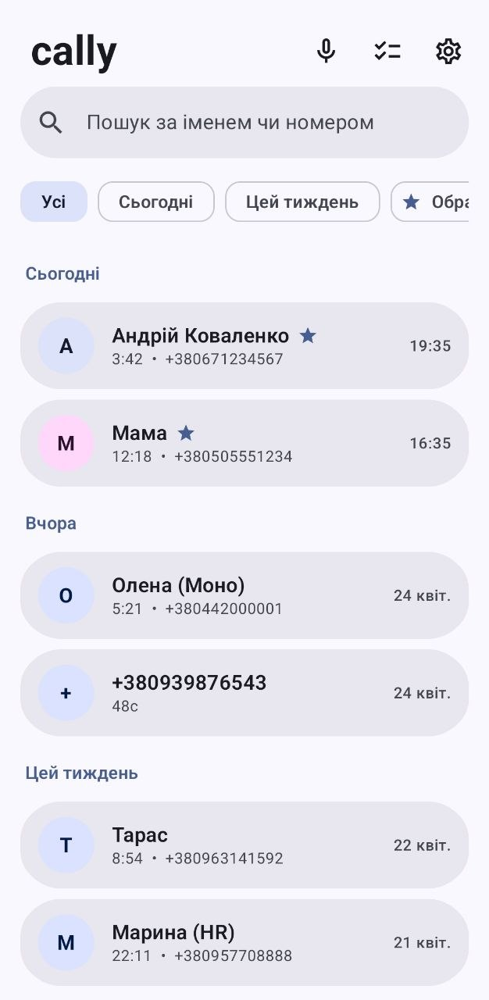
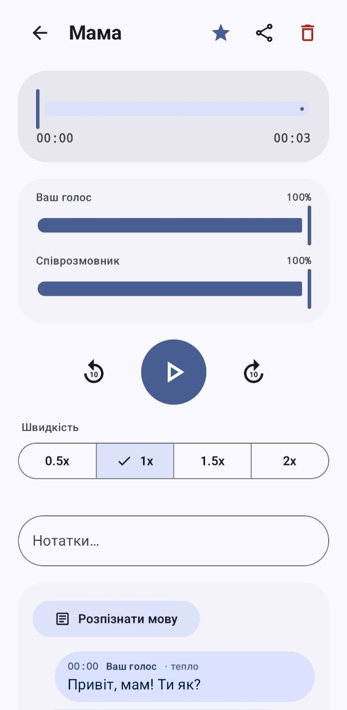
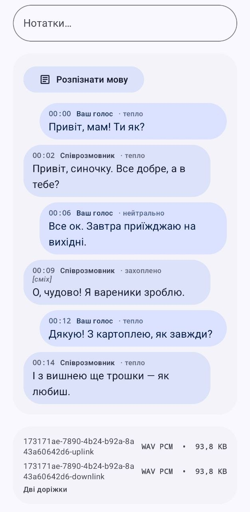
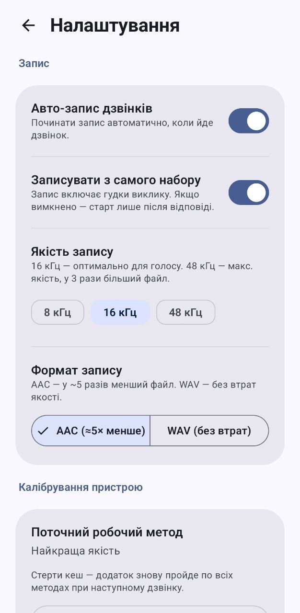

# Cally — Pixel 通话录音

在原生 **Pixel 6+** (Tensor) 及其他现代 Android 设备上录制电话通话，
**无需 root、无需解锁 bootloader**，通过 Shizuku 实现。

<p align="center">
  
  
  
  
</p>

> **状态：MVP 骨架 (v0.1.0)。** 所有核心功能 — AIDL 桥梁、Shizuku
> UserService、双轨录音与回退链、WAV 写入器、前台服务、
> Material 3 Expressive UI — 已实现。公开发布前
> 需在实际设备上通过 [「真机测试」](#真机测试) 的手动测试矩阵。

## 为什么选择 Cally

在原生 Pixel 上，所有普通的通话录音应用 **都无法录制对方的声音**
—— Google 从 Android 10 起对非特权应用封锁了 `VOICE_CALL/UPLINK/DOWNLINK`。
Google 自 2025 年 11 月起在 Phone 应用中推出的原生通话录音功能
**在乌克兰不可用**：截至 2026 年 4 月，已确认支持的地区包括美国、印度、
德国、意大利、西班牙、罗马尼亚、法国、澳大利亚、加拿大、爱尔兰——
Google 在 Pixel 10a 发布前曾宣布将于 2026 年 2 月底前覆盖"所有市场"，
但乌克兰不在支持地区列表中。Google 官方表示该功能仅推送至
"法律不禁止通话录音"的国家，并遵守各国披露提示音政策。
Pixel 上切换地区无效——门控是组合式的（SIM/MCC、Wi-Fi BSSID、GPS、IP），
不像三星（刷 CSC 五分钟即可绕过）。
现有的绕过方案都有显著的代价（root/Magisk 导致 Verified Boot 和 Play Integrity 丢失；
闭源二进制文件；单声道混音且音量失衡）。

**Cally 通过 Shizuku UserService 内的上下文归因来绕过封锁**：
我们的私有服务运行在 shell 进程（UID 2000）中，
AudioRecord 通过一个上下文创建，该上下文的 attribution 与
真实系统包 `com.android.shell` 匹配——这个包在 package DB 中存在，
具有相同的 UID 2000，并持有 signature 级别的 `RECORD_AUDIO`、
`CAPTURE_AUDIO_OUTPUT` 和 `MODIFY_AUDIO_ROUTING` 权限。AudioFlinger
验证 `(uid=2000, pkg="com.android.shell")` 组合与 package DB 的匹配——
该组合是真实的——然后像对系统组件一样开放 `VOICE_*` 音源。
详情见下方[「绕过原理」](#绕过原理)。

### 乌克兰用户的法律背景

乌克兰是 **一方同意（one-party consent）** 的司法管辖区。
通话参与者为个人用途录制自己的电话通话是合法的，无需披露提示音：

- **乌克兰宪法第 31 条** 保障通信秘密免受第三方干涉；通话参与者
  在此保护意义上不属于"第三方"。
- **乌克兰刑法典第 163 条**（"侵犯……电话通话秘密"）
  针对的是未经授权的第三方拦截，而非参与者录制自己的通话。
- **乌克兰《个人数据保护法》（第 2297-VI 号）第 25 条**
  （"本法适用范围的限制"）将个人纯为个人或家庭需求处理数据的行为
  排除在监管之外（家庭豁免，类似 GDPR 第 2(2)(c) 条）。

因此 **Cally 不包含提示音是符合乌克兰法律，而非规避监管要求**
（与美国/欧盟不同，后者的多方同意司法管辖区要求 Google
原生录音器在 Phone 应用中内置强制披露提示音）。

> **注意：** 录制 ≠ 传播。未经对方同意发布录音受到
> **民法典第 306 条第 2 款**（通信秘密权——信件、电话通话及其他通信
> 仅在各方同意下方可使用，包括公开发布）、
> **民法典第 301 条**（个人生活权）以及可能的诽谤诉讼的限制。
> 本工具仅供**个人使用**；发布责任由用户承担。
>
> 以上为一般性概述，非法律建议。对于关键情况
> （新闻调查、企业调查、复杂案件中的证据）——
> 请咨询专门从事信息法的乌克兰律师。

### 乌克兰以外的用户

本法律概述**仅适用于乌克兰司法管辖区**。
各司法管辖区分为**三个同意级别**——从最宽松到最严格。
请找到自己所在的级别——并据此行事。

#### 级别 1 — 无需通知（一方同意）

通话参与者可在不通知对方的情况下录音。自己的同意 = 充分的同意。

- **乌克兰**（如上节所述）
- **美国** — 联邦《窃听法》(18 U.S.C. § 2511) + 约 38 个州
- **英国** — RIPA 2000（参与者）
- **加拿大** — 《刑法典》§ 184(2)(a)（联邦层面的一方同意）
- **澳大利亚** — 联邦《电信（拦截）法》
- **波兰** — 通话参与者
- 大多数拉丁美洲国家

#### 级别 2 — 通知即足够（多方同意 + 默示同意）

需要在通话开始时通知对方。如果对方听到通知后继续通话——
这构成**默示同意**，录音合法。该原则已由数十年的判例法确立。

- **约 11 个美国州**：加利福尼亚（CA Penal Code § 632）、佛罗里达、
  伊利诺伊、马里兰、马萨诸塞、蒙大拿、内华达、新罕布什尔、
  宾夕法尼亚、华盛顿、康涅狄格
- 部分欧盟国家的商业场景（典型的客服热线声明
  "本次通话可能被录音用于质量目的"——正是同一机制）

在这些司法管辖区，通话开始时的口头通知（"我提醒您，
本次通话正在录音"）法律上已足够。

#### 级别 3 — 即使通知也禁止（需要明确同意）

简单的通知不能使录音合法化。需要每个参与者的**明确的知情同意**——
在某些情况下需要书面形式。否则——面临刑事指控。

- **德国** — § 201 StGB *Vertraulichkeit des Wortes*：未经明确许可录制
  "非公开口头言论"最高可判处**3 年监禁**。德国法院不承认
  私人通话中的默示同意。
- **奥地利** — § 120 StGB *Missbrauch von Tonaufnahme- oder Abhörgeräten*
  （类似制度）
- **比利时** — 《电子通信法》+ 刑法：明确同意是强制性的，
  许多情况下需要书面形式
- 一些隐私制度严格的司法管辖区（阿联酋、沙特阿拉伯）——
  实际执法比法律条文更严厉，刑事追诉风险高

**在第 3 级国家，若无对方明确的"是的，我同意"，**
**不应使用 Cally**——未经同意的录音构成刑事犯罪，
即使你是通话参与者，即使是用于个人存档。

#### GDPR — 附加层（欧盟）

在刑事法律之上，欧盟还有数据保护框架：

- **个人存档**用于家庭需求被排除在 GDPR 之外
  （第 2(2)(c) 条，家庭豁免）——对第 1 级国家，这消除了 GDPR 部分的问题。
  但刑事法律（如 DE/AT/BE）独立适用。
- **通过云端 STT 转录**、分享录音、转发给同事、
  用于商业目的存档——家庭豁免不再适用，需要合法依据（GDPR 第 6 条）。

#### Cally 技术层面上无法实现提示音

Cally **无法**将提示音或语音公告播放到对方听筒中——
这是平台特权操作。原生 Pixel Phone（Android 14+）
通过直接调用 Audio HAL 的私有 API 实现此功能，第三方应用
即使通过 Shizuku 绕过 shell-UID 也无法访问。
不存在写入语音通话上行链路的公开 SDK API，
而回声消除器 (AEC) 会使"通过扬声器播放提示音"的取巧方法失效。

实际含义：

- **级别 1**：Cally 完全满足要求（根本没有此要求）。
- **级别 2**：通话开始时的口头通知——法律上有效的变通方案
  （构成默示同意）。
- **级别 3**：口头通知法律上不足够。Cally **技术上无法满足此要求**，
  应用端没有变通方案——需要对方的明确同意，
  你需要在录音开始前通过单独渠道获取。

#### 总结

| 操作 | 级别 1 | 级别 2 | 级别 3 |
|---|---|---|---|
| 未经通知录制自己的通话 | 允许 | 禁止 | 禁止 |
| 口头通知后录制 | 允许 | 允许（默示同意） | 禁止 |
| 所有参与者明确同意后录制 | 允许 | 允许 | 允许 |
| 未经同意分享录音 | 隐私/诽谤风险 | 禁止 | 禁止 |

**在乌克兰境外使用 Cally 之前——请查阅当地法律。**
特别注意：与级别 2/3 国家的对方通话；
在企业/新闻/司法场景中录音；
在欧盟进行二次数据处理（转录、分享、存档）。

## 技术栈

| 层次 | 技术 |
|---|---|
| UI | Jetpack Compose · Material 3 Expressive (`material3 1.4.0-beta01`) · Material You 动态色彩 |
| 构建 | AGP 8.8 · Kotlin 2.1.20 (K2) · KSP · Gradle 8.11 · JDK 21 toolchain |
| 持久化 | Room 2.7（通话元数据）· DataStore Preferences（设置） |
| IPC | AIDL 单向 Binder · Shizuku 13.1.5（UserService 守护进程，`daemon=true`） |
| 录音 | 通过 Shizuku 的 shell-UID `app_process` · `WrappedShellContext`（伪装 `com.android.shell`）· 在主 Looper 上调用 `AudioRecord.Builder().setContext(...)` · 5 步回退链 + 实时可听性验证 |
| 编码 | AAC 封装 MP4（`MediaCodec` + `MediaMuxer`，默认）或 WAV（RIFF，可选）· 每轨独立 |
| FGS | `type=specialUse`（麦克风访问在 shell 进程中）+ 不可见 1×1 overlay 作为 Android 14+ "后台启动 FGS" 的绕过方案 |
| 网络 | INTERNET 权限**仅用于可选的**云端转录，通过用户配置的 OpenAI 兼容 chat-completions 端点（支持 `input_audio` content parts，默认：OpenRouter+Gemini Flash；自托管——详见[安全与隐私](#安全与隐私)）。如未输入 API 密钥，转录功能完全关闭。录音本身从不接触网络。无任何 Firebase/Crashlytics/Sentry/analytics。 |

`minSdk = 31`（Pixel 6+ 运行 Android 12），`targetSdk = compileSdk = 36`（Android 16）。

## 绕过原理

八层技术栈，每层解除 AudioFlinger / framework 的一个特定门控。
前五层是来自
[scrcpy 2.0](https://github.com/Genymobile/scrcpy/blob/master/server/src/main/java/com/genymobile/scrcpy/Workarounds.java)
的**公开技术**（yume-chan，2023 年 3 月），
在该项目中用于镜像音频输出（`REMOTE_SUBMIX`）。Cally
**将其应用于电话音频源**（`VOICE_UPLINK/DOWNLINK/CALL`）——
我们未找到此特定应用的公开描述。第 6-8 层（实时可听性回退链、
FGS 绕过组合、签名锁定）是本项目的工程成果，
针对通话录音的具体问题（三星上行静音、
Pixel 10 麦克风前置放大器漂移、守护进程攻击面）。

### 1. 以 shell-UID (UID 2000) 运行

Shizuku 在其 `app_process`（UID 2000 = `shell`）中启动我们的 `RecorderService`。
在普通应用进程中，`VOICE_UPLINK` / `VOICE_DOWNLINK` / `VOICE_CALL`
会被 AudioFlinger 阻止，但 shell 是持有 `signature` 级权限的系统主体。
这是必要条件，但**不充分**：仅在 UID 2000 下运行并不能获得音频，
因为 AudioFlinger 不仅检查 UID，还检查包名。

### 2. 上下文归因为 `com.android.shell`

`userservice/WrappedShellContext.kt` 包装系统 Context，
使身份方法（`getOpPackageName()`、`getPackageName()`、
`getAttributionSource()`）返回 `com.android.shell`。
该包真实存在于 package DB 中，UID 为 2000——与我们的 shell 进程
运行的 UID 相同。AudioFlinger 的门控 `createFromTrustedUidNoPackage`
验证 `(uid=2000, pkg="com.android.shell")` 组合与 package DB 的匹配并放行，
因为这对 `(uid, pkg)` 组合是 shell 进程的真实组合。
这不是伪造的凭据——这是运行在 shell UID 下的进程的有效归因。

> 此前尝试过"受信任的 UID 无包名"——`AttributionSource.Builder(2000)`
> 不带 `setPackageName(...)`。无效：门控会将包名与 DB 验证，
> 空包名无法通过。

### 3. 通过反射修补 ActivityThread

仅覆盖 Context 的身份方法不够——AudioFlinger
通过以下链路溯源调用者身份：
`AudioRecord.mAttributionSource ← Context.getAttributionSource() ←
Application.getAttributionSource() ← ActivityThread.currentApplication() ←
ActivityThread.mInitialApplication ← AppBindData.appInfo`。
如果链中任何一个环节返回真实的 UID/包名，门控就会失败。
因此我们修补 `android.app.ActivityThread` 的私有字段：

| 字段 | 设置值 | 目的 |
| --- | --- | --- |
| `mSystemThread` | `true` | AudioFlinger 和 AppOps 将系统进程视为预授权，跳过逐包检查 |
| `mInitialApplication` | 伪造的 `Application`，绑定到 `WrappedShellContext` | `currentApplication()` 返回我们的 Application |
| `sCurrentActivityThread` | 当前的 AT | 某些路径直接获取 AT，绕过 `currentApplication()` |
| `mBoundApplication.appInfo` | `ApplicationInfo{ packageName="com.android.shell", uid=2000 }` | AudioFlinger 有时通过替代路径解析包名 |

`org.lsposed.hiddenapibypass.HiddenApiBypass` 解除 Android-P+ 的 hidden-API
限制，否则对 ActivityThread 的反射会抛出
`NoSuchFieldException`。

### 4. AudioRecord 构造——必须在主 Looper 上

AudioFlinger 的 AppOps `RECORD_AUDIO` 检查读取 **线程本地的 hook**，
在 shell 进程的 Binder 线程中这些 hook 为空。因此我们通过
`Handler.post {...}` + `CountDownLatch.await(2s)` 将
`AudioRecord.Builder().build()` 投递到进程的主 Looper。
在主线程上，ActivityThread 设置了正确的线程本地变量，
门控看到我们包装后的身份，构造函数返回 `STATE_INITIALIZED`。
实现见 `AudioRecorderJob.kt:83`。

### 5. Builder API + `.setContext(WrappedShellContext)`

传统的 5 参数 AudioRecord 构造函数直接从 ActivityThread 静态变量
读取 AttributionSource——我们的 Context 无法被看到。**只有**
`AudioRecord.Builder().setContext(wrappedContext).build()`（API 31+）
从传入的 Context 中获取 attribution。因此 `minSdk=31`
不仅是 Material 3 的要求，更是**绕过方案的结构性约束**。

### 6. 实时可听性验证 + 5 步回退链

身份验证是必要的，但不充分：在不同 HAL 上，即使 AudioRecord 成功初始化，
调制解调器有时也会返回静音。`RecorderController.kt` 按以下顺序尝试策略：

1. **DualUplinkDownlink** — `VOICE_UPLINK` + `VOICE_DOWNLINK` 并行（两条单声道轨道，回放时可独立调节平衡，理想方案）。
2. **DualMicDownlink** — `MIC` + `VOICE_DOWNLINK`（三星友好：调制解调器常阻止 UPLINK，MIC 可绕过）。
3. **SingleVoiceCallStereo** — `VOICE_CALL` 立体声（L=上行，R=下行）。
4. **SingleVoiceCallMono** — `VOICE_CALL` 单声道（HAL 混音）。
5. **SingleMic** — 仅 `MIC`（最后手段，通过扬声器，保证可用）。

每次尝试：

- 构造 → 若 `STATE_UNINITIALIZED`，永久记入 `knownFailedInit`（按 `Build.FINGERPRINT` 区分）。
- 录音 → 5 秒窗口，对两轨进行 RMS 测量，使用**自适应噪底**（`AudioLevelMeter.calibratedFloor`——前约 500 ms 样本的中位数）。音频"可听"条件为 `lastRms > calibratedFloor + AUDIBLE_DELTA (0.008)`——阈值根据每路流动态学习，而非固定的全局常量，因此在 Pixel 10（mic 漂移约 -50 dBFS）和带有主动降噪芯片的三星设备上均能正确工作。
- 列入黑名单前给予"3 次机会"（三星调制解调器有时不会立即打开音频路径——一次静音尝试 ≠ 永久不可用）。
- 成功 → 缓存到 `preferredStrategy`，下次通话直接使用。

通话结束时，`downgradeIfHalfSilent()` 检查每轨的 `maxRms`
并丢弃静音的一侧（三星上通常是 UPLINK = 静音，DOWNLINK 通过侧音包含双方声音——
没必要保存 2 分钟的零值数据）。

缓存键基于 `Build.FINGERPRINT` → 系统更新自动失效。

### 7. 后台启动 FGS 的绕过方案 (Android 14+)

`telephony.CallStateReceiver`（manifest 广播）无法直接启动 FGS——
Android 14+ 以 `PROCESS_STATE_RECEIVER` 阻止此操作。
我们不使用 `type=microphone`（会受到更严格的门控），
而是声明 `type=specialUse`——实际的麦克风访问在 Shizuku shell 进程中，
不在我们的进程中。在 `startForegroundService(...)` 之前，
短暂（3 秒）通过 `SYSTEM_ALERT_WINDOW` 添加一个 1×1 px 不可见 overlay
（`telephony/OverlayTrick.kt`）——系统暂时将进程提升到前台状态，
足以让 FGS 合法启动。之后移除 overlay；FGS 已凭借自身权限运行。

`accessibility/CallrecAccessibilityService.kt` — 空 stub，
在 manifest 中声明为**可选**的后备方案，用于激进的 OEM（小米/MIUI）。
BIND_ACCESSIBILITY_SERVICE 也是 FGS 限制的豁免项。
用户仅在 overlay-trick 无效时才启用它。

### 8. 防范其他 Shizuku 授权应用

`daemon=true` 意味着特权进程在我们的应用退出后仍然存活。任何其他
具有 Shizuku 权限的包理论上可以枚举 Binder 并
调用我们的 `IRecorderService`。`RecorderService.verifyCaller()`
在**每次** AIDL 调用时验证：

- `Binder.getCallingUid()` → 包列表 → 必须包含 `dev.lyo.callrec[.<suffix>]`。
- Release 证书的 SHA-256 签名 → 与编译时通过 Gradle 属性
  `callrec.signingSha256` 烘焙到 userservice 模块的常量对比。

在 debug 构建中，签名锁定为空——跳过验证。

## 持久性与未来展望

此绕过方案**并非永久有效，已面临威胁**。客观评估：

**历史背景。** Google 每 2-3 年系统性地关闭非 root 的通话录音途径：
Android 6 → 9（公开 API 的 VOICE_CALL）、
Android 10（VOICE_* 需要 signature|privileged 权限）、
Android 11/12（禁止基于无障碍服务的录音——导致 ACR Phone 失效）、
Android 15（通话期间对 `MediaRecorder` 的新限制）。趋势是线性的。

**最新的警报信号。** 2025 年 5 月，Android 16 QPR1 Beta 中
[scrcpy #6113](https://github.com/Genymobile/scrcpy/issues/6113) 的音频捕获失效——
与 Cally 使用的机制完全相同（`FakePackageNameContext` + `AudioRecord.Builder`）。
这尚不是针对通话录音应用的蓄意攻击，
而是音频框架变更的附带效应，直接影响到我们。
在稳定版 Android 16（2025 年秋季推送至 Pixel）上，
Cally 可能不经更新就无法工作。

**政治背景（双重性）。** 2025 年 11 月，Google 通过 Phone by Google
向 Android 14+ 的 Pixel 6+ 全球推送了**原生通话录音**。
该功能带有强制性披露提示音，*"不可绕过"*。
这使 Google 在多方同意司法管辖区（美国/欧盟）获得了
针对非官方录音应用的监管立场："我们已有合规的解决方案；
无同意的绕过方案是蓄意违规。"

**对乌克兰而言，这一立场不成立**——原生方案在乌克兰不可用，
提示音在法律上不需要（一方同意），Pixel 无法切换地区。
即 Google 没有针对乌克兰特定工具的监管压力依据。
技术风险（如 scrcpy #6113 的附带破坏）依然存在，
但在我们的场景中，针对 Cally 的监管/政治 loud-loud 攻击向量
远弱于针对美国/欧盟的类似应用。

**我们预期的最廉价技术修复：** AudioPolicyManager 为
VOICE_UPLINK/DOWNLINK/CALL 添加签名检查——门控不仅验证
(uid, package)，还要求 APK 使用框架证书签名。这将破坏
通过身份伪装的通话录音，但不影响 scrcpy 或其他合法的调试工具——
因此 Google 可以在没有社区反弹的情况下实施。一行代码；
这是最需要警惕的攻击向量。

**现实的稳定期预期：** 在持续更新的原生 Pixel 上为 12-18 个月，
加减一个监管周期。每次 Android 大版本发布后，
5 步回退链会被激活——如果一种策略"失效"，
会自动尝试其他策略。如果所有五种策略都失效——
应用会诚实地显示错误，不会无声地录制空白音频。

**早期预警信号：** scrcpy 3.x 的 release notes。
如果 yume-chan 写道 "FakePackageNameContext no longer works on Android X,
audio capture removed"——这是你的 6 个月预警铃。
请订阅 [scrcpy releases](https://github.com/Genymobile/scrcpy/releases)。

**我们不承诺：** "Pixel 上永久可用的通话录音"。如果你看到此类承诺——
要么是营销，要么是使用了危险技术（root、自定义 recovery、伪造系统应用）。

## 项目结构

```text
callrec/
├── settings.gradle.kts                 # Gradle 多模块配置
├── build.gradle.kts                    # 根项目，仅插件别名
├── gradle/libs.versions.toml           # 版本目录（单一事实来源）
├── aidl/                               # IRecorderService AIDL 合约（无代码）
├── userservice/                        # 在 Shizuku shell 进程（UID 2000）中运行的代码
│   ├── RecorderService.kt              #   IRecorderService.Stub — 入口点
│   ├── AudioRecorderJob.kt             #   单个 AudioRecord 泵
│   ├── HiddenApiBootstrap.kt           #   通过 HiddenApiBypass 绕过 hidden-API 限制
│   └── ServiceContext.kt               #   用于 verifyCaller 的反射系统 Context
└── app/                                # 普通用户进程
    ├── recorder/                       #   ShizukuClient + RecorderController（回退链）
    ├── codec/                          #   PcmEncoder · WavEncoder
    ├── telephony/                      #   CallStateMonitor · CallMonitorService（前台）
    ├── storage/                        #   Room (CallRecord) · RecordingStorage
    ├── settings/                       #   DataStore 偏好设置
    ├── notify/                         #   通知渠道 + 录音通知
    ├── di/                             #   手动 DI (AppContainer)
    └── ui/                             #   Compose: Onboarding · Home · Library · Playback
```

## 前置条件

- **Android Studio Ladybug Feature Drop (2024.3.x) 或更新版本** — 用于 AGP 8.8 / Kotlin 2.1。
- **主机上的 JDK 21**。如果 Studio 中启用了 Foojay resolver（8.7+ 默认启用），
  Gradle 中的 toolchain 会自动下载 Eclipse Temurin 21。
- **Android SDK 36** + Build Tools。
- **已激活 Shizuku 的 Pixel 设备** — 用于运行。

## 构建

1. 克隆仓库。
2. 生成 Gradle wrapper jar（一次性）：

    ```bash
    # 如果系统已安装 gradle (8.11+)：
    gradle wrapper --gradle-version 8.11.1 --distribution-type bin

    # 或从 Android Studio 复制：
    cp -r "$HOME/Library/Application Support/Google/AndroidStudio*/distributions/.../gradle-8.11/bin/gradle-wrapper.jar" gradle/wrapper/
    ```

3. 构建：

    ```bash
    ./gradlew :app:assembleDebug                  # debug APK 在 app/build/outputs/apk/debug/
    ./gradlew :app:assembleRelease                # release（需要 keystore.properties — 见下文）
    ./gradlew :app:test :app:lint                 # 单元测试 + lint
    ./gradlew :app:connectedAndroidTest           # 仪器化测试（需要设备）
    ```

## 发布签名

在项目根目录创建 `keystore.properties`（已 gitignored）：

```properties
storeFile=/绝对/路径/到/release.jks
storePassword=…
keyAlias=callrec
keyPassword=…
```

并添加 release 证书的 SHA-256 作为 Gradle 属性（小写十六进制，无冒号）—
`UserService.verifyCaller()` 将其用作签名锁定：

```bash
# 获取 SHA-256：
keytool -list -v -keystore release.jks -alias callrec | grep "SHA-256" | awk '{print $2}' | tr -d ':' | tr 'A-Z' 'a-z'

# 保存为 Gradle 属性 (~/.gradle/gradle.properties)：
echo "callrec.signingSha256=<hash>" >> ~/.gradle/gradle.properties
```

在 debug 构建中，`signingSha256` 为空 → 跳过验证，
使本地开发不需要签名锁定。

## 使用

1. 安装 **Shizuku** — 推荐社区构建版 [thedjchi/Shizuku](https://github.com/thedjchi/Shizuku/releases)
   （自动重启看门狗、持久 ADB 配对、活跃维护）。上游 RikkaApps 长期未更新。
2. 通过**无线调试**激活 Shizuku（无需 USB 线）：
   - 设置 → 开发者选项 → 无线调试 → 开启
   - 在 Shizuku 应用中 → "通过无线调试配对"
3. 安装 Cally APK。
4. 首次启动时授予 Shizuku 权限（系统对话框）。
5. 拨打测试电话。通话在 OFFHOOK 时开始录音，将两个 WAV 文件写入
   `/storage/emulated/0/Android/data/dev.lyo.callrec/files/recordings/`。

## 真机测试

首次发布前 — 完成**必须检查项**：

- [ ] Shizuku 未激活 → UI 优雅降级，显示安装按钮
- [ ] 录音期间使用蓝牙耳机 → 录音继续或优雅停止
- [ ] 连续 5 次以上通话 → 守护进程稳定复用
- [ ] 重启 → 守护进程需重新创建（Shizuku 服务器也会重启）
- [ ] 三星 S22+ → 回退链降至 MIC，无崩溃

维护实际表格：`docs/device-matrix.md`（当前为空——在每个测试设备上填充）。

## 待完成（完整 v1.0 的 TODO）

- [x] **运行时权限流程** — `permissions/AppPermissions.kt` + `SetupChecks.kt`。
- [x] **AAC 编码器** — `codec/AacEncoder.kt`（MediaCodec + MediaMuxer，默认）。WAV — 可选。
- [x] **实时可听性验证** — `RecorderController` + 按 `Build.FINGERPRINT` 缓存的 5 步回退链（替代首次通话校准）。
- [x] **立体声混音导出** — `codec/AudioMixer.kt` + 播放器中的分享对话框（`ui/playback/Sharing.kt`，缓存于 `cacheDir/export/`）。
- [x] **联系人解析** — `contacts/ContactResolver.kt` + `CallLogResolver.kt`。
- [ ] **SAF 集成** — `OpenDocumentTree` 用于外部存储，镜像到 `MediaStore`
      使录音在任何文件管理器中可见。
- [x] **波形视图** — `codec/Waveform.kt`（峰值幅度缩减器）+ `ui/playback/WaveformView.kt`（Canvas，点击 + 拖动进行 seek；双轨时显示两条镜像轨道）。
- [ ] **i18n** — 英文语言包（当前仅 uk-UA）。

## 安全与隐私

- **无任何 Firebase / Crashlytics / Sentry / analytics / telemetry。** 可通过 grep 验证——依赖中零云端 SDK。
- **INTERNET 权限存在**，但仅用于可选的云端转录。在用户在设置中输入 API 密钥之前，完全没有网络请求。端点可由用户配置——可指定自托管服务器。技术要求：端点需支持带有 `input_audio` content parts 的 OpenAI chat-completions API（格式为 gpt-4o-audio / Gemini multimodal，**不是** Whisper transcription API）。截至 2026 年的可用自托管方案：**vLLM-Omni with Qwen2.5-Omni-7B**（[docs.vllm.ai/projects/vllm-omni](https://docs.vllm.ai/projects/vllm-omni/)），**vLLM with Gemma 4 E2B/E4B**（audio multimodal，2025 年中+）。标准 vLLM serve 用于 Qwen2.5-Omni 目前仅输出文本（thinker 模式）；要通过 chat-completions 进行音频输入，需要 vLLM-Omni fork。纯 Whisper 服务器（whisper.cpp、faster-whisper）当前代码不支持——它们的端点格式不同。在自托管模式下，音频不会离开你的网络。
- **录音本身从不接触网络。** 文件写入 `Android/data/dev.lyo.callrec/files/recordings/` 并在用户自行导出前保留在那里。
- `RecorderService.verifyCaller()` 在**每次** AIDL 调用时验证 UID + release 证书的 SHA-256。由于 `daemon=true`，服务在我们的应用退出后仍存活——这是为了防范其他具有 Shizuku 权限的应用理论上发现我们的 Binder。
- `data_extraction_rules.xml` + `backup_rules.xml` 禁止 adb 备份和云端恢复。
- `network_security_config.xml` 禁止明文流量——用户 API 密钥的 bearer token 即使因拼写错误/重定向降级协议也不会泄露。
- 录音进行中的通知 — `setOngoing(true)` + `VISIBILITY_PUBLIC`。不隐藏。

> **关于 API 密钥的注意事项：** STT 转录的密钥以明文存储在 Android DataStore（应用私有沙箱存储）中。在无 root 权限的已解锁设备上，只有应用本身可以读取它；在已 root 或 forensic 提取的镜像上——任何有 shell 权限的人都可以读取。如果你的威胁模型不能容忍这一点——不要使用云端转录，或指定本地自托管端点。

## 许可证

GPL-3.0-or-later — 全文见 [`LICENSE`](LICENSE)。架构与 BCR (chenxiaolong) 有渊源。

---

问题、Bug、想法 — Issues。来自新设备矩阵的 Pull Requests — 特别欢迎。
