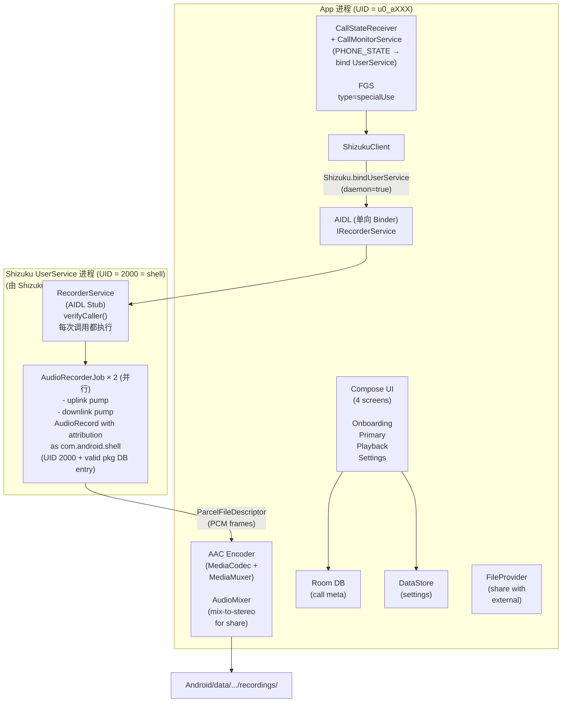

# 架构

Cally 的公开架构总览——不包含内部绕过方案的详细手册（详细工程笔记为私有）。

## 高层架构



## 为什么是 3 个模块

- **`:aidl`** — 独立的 Android-library 模块，仅包含 AIDL 合约。独立是因为 `:app`（调用方）和 `:userservice`（被调用方）都需要导入它；两者不应相互导入。
- **`:userservice`** — 独立的 Android-library 模块，包含将在 Shizuku 启动的 `app_process`（UID shell）中加载和执行的代码。独立的 R8/ProGuard 预设（`consumer-rules.pro`）保护 `RecorderService` 和 `AudioRecorderJob` 不被 minify-rename，因为 Shizuku 通过 FQCN 反射查找它们。
- **`:app`** — 普通 Android application 模块，UI + 前台服务 + 转录 + 存储。

这种隔离允许：
1. R8 对 `:app` 代码（UI、转录、存储）进行激进 minify，不触及 `:userservice` 中的 load-bearing 类。
2. 原子性地更改 `:aidl` 合约——通过 bump `userServiceVersion` 同步更新两端。
3. 安全审计聚焦于 `:userservice` 中的约 6 个文件，而非整个应用。

## 为什么选择 Shizuku，而非 root / 无障碍服务 / 系统应用

| 方案 | 为什么不行 |
|---|---|
| **Magisk root + 系统应用** | 破坏 Verified Boot。Play Integrity 失败 → 银行应用崩溃。 |
| **Magisk + LSPosed hooks** | 同上。+ 尾部风险：LSPosed 模块在 Android 更新时可能损坏。 |
| **无障碍服务用于核心录音** | 自 2022 年起被 Play Store 政策禁止。不良实践。 |
| **InCallService** | 仅对默认拨号器应用可用。用户需要更换 Phone 应用——UX 致命伤。 |
| **VOICE_RECOGNITION + 后处理** | Pixel Tensor 上大多数通话——仅上行，下行丢失。三星——增益不匹配。 |
| **`pm grant CAPTURE_AUDIO_OUTPUT`** | 权限保护级别为 `signature\|privileged\|role`。`pm grant` 无法授予。 |
| **Shizuku** | 用户通过无线调试（无需 USB）主动选择加入。实现"按需特权执行"，无持续提升状态。 |

## 录音策略（为什么需要回退链）

我们不依赖单一策略，因为不同厂商的 HAL 在 shell-UID + 电话音源下表现各异。`RecorderController` 按顺序尝试：

1. `VOICE_UPLINK` + `VOICE_DOWNLINK` 并行 — 理想方案，两条单声道轨道可在播放器中独立调节平衡。
2. `MIC` + `VOICE_DOWNLINK` — 三星友好：调制解调器经常阻止 UPLINK，MIC-uplink 通过扬声器路径绕过。
3. `VOICE_CALL` 立体声 — L=上行，R=下行（如果 HAL 支持分离）。
4. `VOICE_CALL` 单声道 — HAL 混音。
5. `MIC` only — 最后手段，通过扬声器。

每次尝试都经过**实时可听性验证**：5 秒窗口，对两轨进行 RMS 测量，对比**自适应噪底**（`AudioLevelMeter.calibratedFloor`——前约 500 ms 样本的中位数）+ `AUDIBLE_DELTA = 0.008`（约 +6 dB）。阈值按每路流动态学习，而非固定常量——这在 Pixel（mic 漂移约 -50 dBFS）和三星（降噪芯片激活）上均能正确工作。如果静音——策略"失败"，移至下一个。列入黑名单前给予"3 次机会"——三星调制解调器有时不会立即打开音频路径。

成功策略按 `Build.FINGERPRINT` 缓存——下次通话直接使用。

## FGS 架构细节

前台服务 `CallMonitorService` 使用 **`type=specialUse`** 而非 `type=microphone`。原因：

- 实际的 `AudioRecord` 存在于 Shizuku UserService（独立进程，UID 2000）中。
- 我们的 FGS 不直接打开麦克风——它协调生命周期、通知、编码/存储。
- `type=microphone` 会触发 Android 的麦克风归因强制措施，针对不打开麦克风的进程——架构上不正确。
- `type=specialUse` 不受 Android 14+ "后台启动 FGS" 限制。

`PROPERTY_SPECIAL_USE_FGS_SUBTYPE` 的完整理由在 manifest 中声明——符合 Play Store 披露要求（尽管我们不在 Play Store 上架）。

为了从后台启动 FGS（当手机处于 Doze 模式时从 `CallStateReceiver` 启动），我们通过 `SYSTEM_ALERT_WINDOW` 使用不可见的 1×1 px overlay——这是 Android 的标准豁免：能够绘制 overlay 的应用被允许从后台启动 FGS。

## 守护进程生命周期（带有 `daemon=true` 的 Shizuku UserService）

UserService 启动一次，并在我们的 `:app` 进程终止或用户从最近任务中划掉 Cally **之后继续存活**。影响：

- ✅ 下次通话时录音启动快（0 启动开销）。
- ✅ 保持与 AudioFlinger session 的绑定，无需重新初始化。
- ⚠️ 守护进程是安全暴露面。任何具有 Shizuku 权限的应用理论上都可以对我们的 Stub 执行 binder 事务。因此每个 AIDL 方法调用都经过 `verifyCaller()`：验证 `Binder.getCallingUid()` + release 证书 SHA-256 签名锁定。
- ⚠️ APK 升级时——守护进程将 `BuildConfig.VERSION_CODE_USERSERVICE` 与其内存中的副本进行比对，版本不匹配时重新生成。这就是为什么**每次**更改 AIDL/pump/verify 时必须 bump `userServiceVersion`（否则升级后旧守护进程会静默损坏）。

## 存储布局

```
/storage/emulated/0/Android/data/dev.lyo.callrec/files/
├── recordings/
│   ├── 2026-04-15T14-22-31_+380501234567_uplink.m4a
│   ├── 2026-04-15T14-22-31_+380501234567_downlink.m4a
│   └── ...
└── transcripts/
    └── 2026-04-15T14-22-31_+380501234567.json   （如已请求）

cache/
└── export/
    └── <uuid>_stereo.m4a   （临时立体声混音文件，用于分享）
```

元数据（联系人姓名、时长、策略成功状态）——存储在 app 私有存储的 Room DB 中（`/data/data/dev.lyo.callrec/databases/`）。

## 延伸阅读

- [`PRIVACY.md`](../PRIVACY.md) — 精确的数据处理边界。
- [`docs/threat-model.md`](threat-model.md) — 防御什么、不防御什么。
- [`docs/device-matrix.md`](device-matrix.md) — 具体设备上的实际测试结果。
- README → "绕过原理" — 8 层技术栈逐步说明。
- [`SECURITY.md`](../SECURITY.md) — 如何报告安全漏洞。
